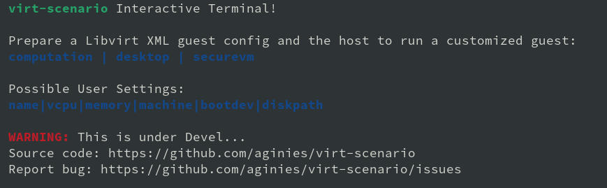
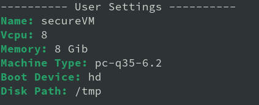
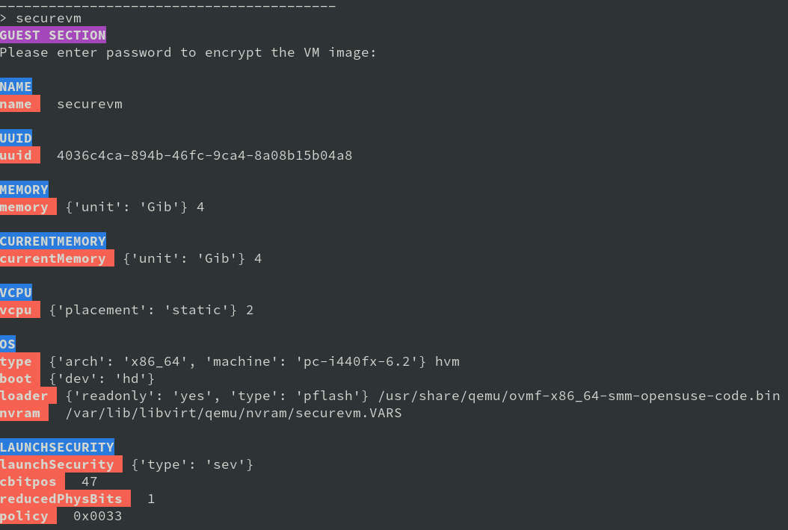
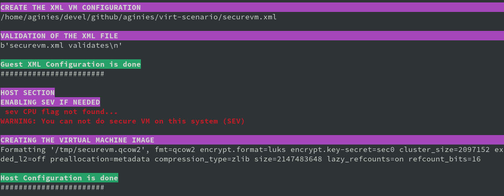

# GOALS

**EXPERIMENTATION** FOR [SUSE ALP OS](https://documentation.suse.com/alp/all/)

Prepare a libvirt XML guest configuration and the host to run a customized guest.
Idea is to use multiple **templates** and concatenate them to create the
expected Guest XML file. If Host need a custom setting it will be done in second phase.

Customization to match a specific scenario is not graved in stone. The idea is to
prepare a configuration which should improved the usage compared to a basic setting.
This will **NOT guarantee** that this is perfect.






# Devel Information

This **WIP**, a lot of changes can occur in current code.

# Devel planning / TODO

* ~~mechanism to create the Guest XML file from template~~
* ~~define all scenarios (list)~~
* ~~post customization of XML config~~
* ~~show host configuration~~
* ~~implement interactive shell~~
* ~~check if running inside a container (for host configuration)...~~
* ~~do more configuration on the Host side~~
* ~~create needed files on host: images, network definition, etc...~~
* ~~define conflict/compatibility between scenarios (is this still needed?)~~
* improve customization based on scenario (need to get some QA on this...)

# User settings

See [manpage virt-scenario](man/virt-scenario.pod)

# Usage

**main.py** will create an **xml** based file on template and validate it.
Second phase will prepare the host system and create the VM image file.
Currently **desktop**, **computation** and **securevm** are available.

```
git clone https://github.com/aginies/virt-scenario.git
cd virt-scenario/src
python3 -m virtscenario
> conf virtscenario.yaml
> desktop
```

# Default configuration

The default configuration for VM definition are:
* **disk path image**: /var/libvirt/qemu
* **arch**: x86_64
* **machine**: pc-q35-6.2
* **boot_dev**: hd
* **emulator**: /usr/bin/qemu-system-x86_64
* **input**: keyboard and mouse as virtio

They could be overwriten by the choosen scenario.

Depending on scenario the default will change to some other value.

# Possible Scenarios

## Secure VM

| Storage Settings | Value |
| :--------------- | :---: |
| preallocation | metadata |
| encryption| on |
| disk_cache | writethrough |
| lazy_refcounts| on |
| format | qcow2 |
| disk bus | virtio |
| disk cache | none |
| capacity | 20G |
| cluster_size | 8M |

| Host Settings | Value |
| :------------ | :---: |
| HugePages| no |
| KSM | disable |
| swappiness| 0 |
| IO Scheduler | mq-deadline |

| Guest Settings | Value |
| :------------- | :---: |
| CPU migratable | off |
| machine | pc-q35-6.2 |
| boot UEFI | auto |
| vTPM | tpm-crb 2.0 |
| iothreads | 2 |
| video | qxl |
| network | e1000 |
| on_poweroff | destroy |
| on_reboot | destroy |
| on_crash | destroy |
| suspend_to_mem | off |
| suspend_to_disk | off |
| features | acpi apic pae |
| kvm SEV | mem_encrypt=on kvm_amd sev=1 sev_es=1 |
| sec cbitpos | auto |
| sec reducedPhysBits | auto |
| sec policy | auto |

## Computation

| Storage Settings | Value |
| :--------------- | :---: |
| preallocation | off |
| encryption| off |
| lazy_refcounts| on |
| format | raw |
| disk bus | virtio |
| disk cache | unsafe |
| capacity | 20G |

| Host Settings | Value |
| :------------ | :---: |
| HugePages| on |
| KSM | enable |
| KSM merge across | disable |
| swappiness| 0 |
| IO Scheduler | mq-deadline |

| Guest Settings | Value |
| :------------- | :---: |
| CPU migratable | off |
| machine | pc-q35-6.2 |
| watchdog | i6300esb poweroff |
| boot UEFI | ovmf-x86_64-smm-opensuse-code.bin |
| iothreads | 2 |
| video | qxl |
| network | virtio |
| on_poweroff | restart |
| on_reboot | restart |
| on_crash | restart |
| suspend_to_mem | off |
| suspend_to_disk | off |
| features | acpi apic pae |

## Desktop

| Storage Settings | Value |
| :--------------- | :---: |
| preallocation | metadata |
| encryption| off |
| lazy_refcounts| off |
| format | qcow2 |
| disk bus | virtio |
| disk cache | none |
| capacity | 20G |
| cluster_size | 8M |

| Host Settings | Value |
| :------------ | :---: |
| HugePages| yes |
| KSM | enable |
| KSM merge across | enable |
| swappiness| 35 |
| IO Scheduler | mq-deadline |

| Guest Settings | Value |
| :------------- | :---: |
| CPU migratable | on |
| machine | pc-q35-6.2 |
| boot UEFI | ovmf-x86_64-smm-opensuse-code.bin |
| iothreads | 4 |
| video | virtio |
| network | e1000 |
| on_poweroff | destroy |
| on_reboot | restart |
| on_crash | destroy |
| suspend_to_mem | on |
| suspend_to_disk | on |
| features | acpi apic pae |
| TPM | passthrough |
| audio | ac97 |
| usb | qemu-xhci |

## Not yet ready

* Testing an OS
* Easy migration of VM
* Soft RT VM

# Host configuration

* check CPU flag: sev, pdpe1gb, pse
* check SEV libvirt enablement
* enable an AMD SEV system
* generate SEV attestation and update VM XML
* check if running in a container and display host config to apply
* configure HugePages
* enable/disable KSM
* adjust swappiness
* manage IO scheduler

# Possible Features

* CPU performance
* System features
* Security
* Memory performance
* Storage performance
* Video (virtio or others)
* Network performance
* Clock performance
* Using host hardware
* Access host OS filesystem
* AMD SEV

# Stuff currently immutable

This is currently not changeable using the template, this needs to be
adjusted in the futur:
* console_data
* channel_data
* memballoon_data
* rng_data
* metadata_data
* only support 1 disk per VM

# Class / Functions

All scenarios are define in the **Scenarios** class. It can do direct
configuration calling **BasicConfiguration.XXX** or **ComplexConfiguration.XXX**,
or request a specific features calling **Features.XXX**. User setting always
overwrite any values set automatically by scenario.

```
class Scenarios()
	-> BasicConfiguration.XXX
	-> ComplexConfiguration.XXX
	-> Features.XXX
```

```
class Features()
	-> XXX_perf() -> BasicConfiguration.XXX
		      -> ComplexConfiguration.XXX
```

```
class BasicConfiguration()
	name(self, name)
	vcpu(self, vcpu)
	cpumode_pass(self, migratable, extra)
	power(self, suspend_to_mem, suspend_to_disk)
	audio(self, model)
	input(self, inputtype, bus)
	usb(self, model)
	watchdog(self, model, action)
	emulator(self, emulator)
	memory(self, unit, max_memory, memory)
	osdef(self, arch, machine, boot_dev)
	ondef(self, on_poweroff, on_reboot, on_crash)
	features(self, features)
	clock(self, clock_offset, clock)
	iothreads(self, iothreads)
	security_f(self, sectype, secdata)
	video(self, model_type)
```

```
ComplexConfiguration()
	disk(self, disk)
	network(self, mac, network, intertype, iommu)
	access_host_fs(self)
	tpm(self, tpm_model, tpm_type, device_path)
	tpm_emulated(self, tpm_model, tpm_type, version)
```

# Python Files

* [virtscenario.yaml](src/virtscenario.yaml): user setting (overwrite scenario settings)
* [virthosts.yaml](src/virthosts.yaml) Hypervisors list and settings
* [libvirt.py](src/virtscenario/libvirt.py) Wrapper for getting libVirt domain capabilities
* [firmware.py](src/virtscenario/firmware.py) Select the firmware with the required feature-set
* [sev.py](src/virtscenario/sev.py) Get parameters for configuring an SEV or SEV-ES VM
* [template.py](src/virtscenario/template.py) libvirt XML template definition
* [scenario.py](src/virtscenario/scenario.py) different call to create the XML based on the selected scenario
* [configuration.py](src/virtscenario/configuration.py) create the dict with data to file the template
* [features.py](src/virtscenario/features.py) prepare some features for the VM
* [host.py](src/virtscenario/host.py) create the net xml file and the storage, prepare the host
* [guest.py](src/virtscenario/guest.py) create dict to file all the templates
* [immutable.py](src/virtscenario/immutable.py) Immutable data (to be removed when implementation will be done...)
* [qemulist.py](src/virtscenario/qemulist.py) provide list of available options in qemu and some default path
* [util.py](src/virtscenario/util.py) internal needed functions
* [main.py](src/virtscenario/main.py) launch the tool and create the final XML file and host configuration
* [sev.py](src/virtscenario/sev.py) SEV Feature Detection
* [hypervisors.py](src/virtscenario/hypervisors.py) list, select, connect to an hypervisor
* [configstore.py](src/virtscenario/configstore.py) Guest configuration store (used for Confidential computing)


