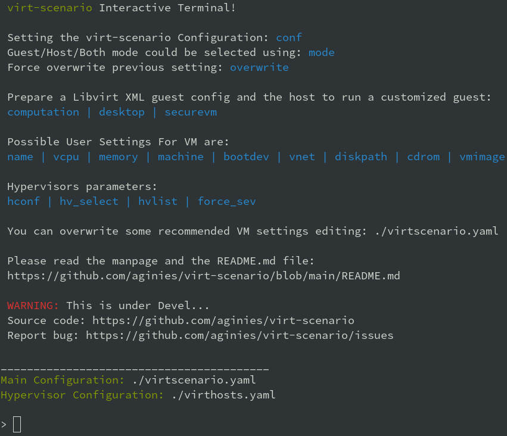

# Name

virt-scenario - Create XML config and prepare host for a specific scenario

# Goals

**EXPERIMENTATION** FOR [SUSE ALP OS](https://documentation.suse.com/alp/all/)

Prepare a libvirt XML guest configuration and the host to run a customized guest.
Idea is to use multiple **templates** and concatenate them to create the
expected Guest XML file. If Host need a custom setting it will be done in second phase.

Customization to match a specific scenario is not graved in stone. The idea is to
prepare a configuration which should improved the usage compared to a basic setting.
This will **NOT guarantee** that this is perfect.




# User Settings

User can set some parameter in the **/etc/virt-scenario/virtscenario.yaml**. This will override the scenario setting (but will display the recommended setting).

Example:
```yaml
# WARNING: INCORRET PARAMATERS WILL LEAD TO BAD VM CONFIGURATION
# Dont change the section name
# This will overwrite scenario settings....
config:
  - path: /etc/virt-scenario
  - vm-config-store: ~/.local/virtscenario/
emulator:
  - emulator: /usr/bin/qemu-system-x86_64
input:
  - keyboard: virtio
  - mouse: virtio
architecture:
  - arch: x86_64
STORAGE_DATA:
# some options are only available with qcow2 format and
# will be ignored in case of any other image format
  - disk_type: file
#  - disk_cache: none
  - disk_target: vda
  - disk_bus: virtio
  - path: /var/livirt/images
  - format: qcow2
# host side: qemu-img creation options (-o), qemu-img --help
  - unit: G
  - capacity: 20
  - cluster_size: 1024k
  - lazy_refcounts: on
# preallocation: off, metadata (qcow2), falloc, full
  - preallocation: off
  - compression_type: zlib
  - encryption: off
host_filesystem:
  - fmode: 644
  - dmode: 755
  - source_dir: /tmp
  - target_dir: /tmp/host
```

**/etc/virt-scenario/virthosts.yaml** is used to define an Hypervisors list mostly for secure VM configuration.
```yaml
localhost:
  url: qemu:///system
# Generate with 'sevctl export --full filename.pdh' on the given host
  sev-cert: /path/to/host-cert-chain.pdh
```

# Usage

## Get it and use it

### From source code

**main.py** will create an **xml** based file on template and validate it.
Second phase will prepare the host system and create the VM image file.
Currently **desktop**, **computation** and **securevm** are available.

```
git clone https://github.com/aginies/virt-scenario.git
cd virt-scenario/src
python3 -m virtscenario
> conf virtscenario.yaml
> desktop
```

Tool to select a firmware based on feature:
```
python3 -m virt_select_firmware
```

Tool to launch the VM from the config file generated by virt-scenario:
```
python3 -m virtscenario-launch
```

#### From Package

Get the package for your Distribution and install it. For openSUSE, SLE:

* [devel stable project](https://build.opensuse.org/package/show/Virtualization/virt-scenario)
* [devel unstable](https://build.opensuse.org/package/show/home:aginies/virt-scenario)

## Default configuration

The default configuration for VM definition are:
* **disk path image**: /var/libvirt/qemu
* **arch**: x86_64
* **machine**: pc-q35-6.2
* **boot_dev**: hd
* **emulator**: /usr/bin/qemu-system-x86_64
* **input**: keyboard and mouse as virtio

They could be overwriten by the choosen scenario.

Depending on scenario the default will change to some other value.

## Interactive commands

### Hypervisor configuration

* **hvconf**: Load Hypervisor configuration
* **hvselect**: Set hypervisor for which VMs are configured
* **hvlist**: List available hypervisors
* **overwrite**: Force overwriting previous config

### Guest configuration 

* **name**: Define a name for the VM
* **vcpu**: Choose how many VCPU
* **memory**: Choose the Memory size (in GiB)
* **machine**: Select the Machine type (from a list)
* **bootdev**: Select the boot dev (from a list)
* **diskpath**: Directory where to store disk image
* **conf**: Path to disk image (with completion)
* **cdrom**: File Path to CD/DVD installation media

### Generate the XML configuration and prepare the host

* **computation**: Create an XML configuration and host config to do computation VM
* **desktop**: Create an XML configuration and host config for Desktop VMU
* **securevm**: Create an XML configuration and host config for Secure VM 

### Others

* **shell**: Execution of a system command

# Possible Scenarios

## Default Settings Comparison 

| [Storage Settings](https://www.qemu.org/docs/master/system/qemu-block-drivers.html) | Secure VM | Computation | Desktop |
| :--------------- | :---: | :---: | :---: |
| preallocation | metadata | off | metadata |
| encryption| on | off | off |
| disk_cache | writethrough | unsafe | none |
| lazy_refcounts| on | on | off |
| format | qcow2 | raw | qcow2 |
| disk bus | virtio | virtio | virtio |
| capacity | 20G | 20G | 20G |
| cluster_size | 1024k | NA | 1024k

| Host Settings | Secure VM | Computation | Desktop |
| :------------ | :---: | :---: | :---: |
| [Transparent HugePages](https://documentation.suse.com/sles/15-SP2/html/SLES-all/cha-tuning-memory.html#sec-tuning-memory-thp) | on | on | on |
| [KSM](https://www.kernel.org/doc/html/latest/admin-guide/mm/ksm.html) | disable | enable | enable |
| [KSM merge across](https://www.kernel.org/doc/Documentation/vm/ksm.txt) | disable | enable | enable |
| [swappiness](https://www.kernel.org/doc/Documentation/vm/swappiness.txt) | 0 | 0 | 35 |
| [IO Scheduler](https://documentation.suse.com/sles/15-SP4/html/SLES-all/cha-tuning-storage.html#sec-tuning-storage-scheduler) | bfq | mq-deadline | mq-deadline |

| Guest Settings | Secure VM | Computation | Desktop |
| :------------- | :---: | :---: | :---: |
| [CPU migratable](https://libvirt.org/kbase/launch_security_sev.html) | off | off | on |
| machine | pc-q35-6.2 | pc-q35-6.2 | pc-q35-6.2 |
| [watchdog](https://libvirt.org/formatdomain.html#watchdog-devices) | none | i6300esb poweroff | none |
| [boot UEFI](https://libvirt.org/formatdomain.html#bios-bootloader) | auto | auto | auto |
| [vTPM](https://libvirt.org/formatdomain.html#tpm-device) | tpm-crb 2.0 | none | none |
| [iothreads](https://libvirt.org/formatdomain.html#iothreads-allocation) | disable | 4 | 4 |
| [video](https://libvirt.org/formatdomain.html#video-devices) | qxl | qxl | virtio |
| [network](https://libvirt.org/formatdomain.html#network-interfaces) | e1000 | virtio | e1000 |
| [keyboard](https://libvirt.org/formatdomain.html#input-devices) | ps2 (will be disable in the futur) | virtio | virtio |
| mouse | disable | virtio | virtio |
| [on_poweroff](https://libvirt.org/formatdomain.html#events-configuration) | destroy | restart | destroy |
| on_reboot | destroy | restart | restart |
| on_crash | destroy | restart | destroy |
| [suspend_to_mem](https://libvirt.org/formatdomain.html#power-management) | off | off | on |
| suspend_to_disk | off | off | on |
| [features](https://libvirt.org/formatdomain.html#hypervisor-features) | acpi apic pae | acpi apic pae | acpi apic pae
| [host fs](https://libvirt.org/formatdomain.html#filesystems) fmode, dmode, source_dir, target_dir | NA | NA | 644 755 /tmp/ /tmp/host |

| SEV | Secure VM | Computation | Desktop |
| :------------ | :---: | :---: | :---: |
| [kvm SEV](https://libvirt.org/kbase/launch_security_sev.html) | mem_encrypt=on kvm_amd sev=1 sev_es=1 | NA | NA |
| sec cbitpos | auto | NA | NA |
| sec reducedPhysBits | auto | NA | NA |
| sec policy | auto | NA | NA |

## Not yet ready

* Testing an OS
* Easy migration of VM
* Soft RT VM (latency improvments)

# Devel Information

This is still **WIP**, but the code is stable. It needs several cleanup and improvements.

## Devel planning / TODO

* ~~mechanism to create the Guest XML file from template~~
* ~~define all scenarios (list)~~
* ~~post customization of XML config~~
* ~~show host configuration~~
* ~~implement interactive shell~~
* ~~check if running inside a container (for host configuration)...~~
* ~~do more configuration on the Host side~~
* ~~create needed files on host: images, network definition, etc...~~
* ~~define conflict/compatibility between scenarios (is this still needed?)~~
* improve customization based on scenario (need to get some QA on this...)

## Code

[Source](https://github.com/aginies/virt-scenario)

[Issues](https://github.com/aginies/virt-scenario/issues)

## Class / Functions

All scenarios are define in the **Scenarios** class. It can do direct
configuration calling **BasicConfiguration.XXX** or **ComplexConfiguration.XXX**,
or request a specific features calling **Features.XXX**. User setting always
overwrite any values set automatically by scenario.

[Scenarios()](src/virtscenario/scenarios.py#L24)
```
class Scenarios()
	-> BasicConfiguration.XXX
	-> ComplexConfiguration.XXX
	-> Features.XXX
```

[Features()](src/virtscenario/features.py#L50)
```
class Features()
	-> XXX_perf() -> BasicConfiguration.XXX
                  -> ComplexConfiguration.XXX
```

[BasicConfiguration()](src/virtscenario/configuration.py#L20)
```
class BasicConfiguration()
	name(self, name)
	vcpu(self, vcpu)
	cpumode_pass(self, migratable, extra)
	power(self, suspend_to_mem, suspend_to_disk)
	audio(self, model)
	input(self, inputtype, bus)
	usb(self, model)
	watchdog(self, model, action)
	emulator(self, emulator)
	memory(self, unit, max_memory, memory)
	osdef(self, arch, machine, boot_dev)
	ondef(self, on_poweroff, on_reboot, on_crash)
	features(self, features)
	clock(self, clock_offset, clock)
	iothreads(self, iothreads)
	security_f(self, sectype, secdata)
	video(self, model_type)
```

[ComplexConfiguration()](src/virtscenario/configuration.py#L214)
```
ComplexConfiguration()
	disk(self, disk)
	network(self, mac, network, intertype, iommu)
	access_host_fs(self)
	tpm(self, tpm_model, tpm_type, device_path)
	tpm_emulated(self, tpm_model, tpm_type, version)
    access_host_fs(self, fmode, dmode, source_dir, target_dir)
```

## Templates definition

All templates are in the python lib **virt-scenario/template.py** file.

## Python Files (virtscenario)

* [virtscenario.yaml](src/virtscenario.yaml): user setting (overwrite scenario settings)
* [virthosts.yaml](src/virthosts.yaml) Hypervisors list and settings
* [libvirt.py](src/virtscenario/libvirt.py) Wrapper for getting libVirt domain capabilities
* [firmware.py](src/virtscenario/firmware.py) Select the firmware with the required feature-set
* [sev.py](src/virtscenario/sev.py) Get parameters for configuring an SEV or SEV-ES VM
* [template.py](src/virtscenario/template.py) libvirt XML template definition
* [scenario.py](src/virtscenario/scenario.py) different call to create the XML based on the selected scenario
* [configuration.py](src/virtscenario/configuration.py) create the dict with data to file the template
* [features.py](src/virtscenario/features.py) prepare some features for the VM
* [host.py](src/virtscenario/host.py) create the net xml file and the storage, prepare the host
* [guest.py](src/virtscenario/guest.py) create dict to file all the templates
* [immutable.py](src/virtscenario/immutable.py) Immutable data (to be removed when implementation will be done...)
* [qemulist.py](src/virtscenario/qemulist.py) provide list of available options in qemu and some default path
* [util.py](src/virtscenario/util.py) internal needed functions
* [main.py](src/virtscenario/main.py) launch the tool and create the final XML file and host configuration
* [sev.py](src/virtscenario/sev.py) SEV Feature Detection
* [hypervisors.py](src/virtscenario/hypervisors.py) list, select, connect to an hypervisor
* [configstore.py](src/virtscenario/configstore.py) Guest configuration store (used for Confidential computing)

## Host configuration

* check CPU flag: sev, sev-es, pdpe1gb, pse
* check SEV libvirt enablement
* enable an AMD SEV system
* generate SEV attestation and update VM XML
* check if running in a container and display host config to apply
* configure HugePages and THP
* enable/disable KSM
* adjust swappiness
* manage IO scheduler

## Possible Guest VM Features

* CPU performance
* System features
* Security
* Memory performance
* Storage performance
* Video (virtio or others)
* Network performance
* Clock performance
* Using host hardware
* Access host OS filesystem
* AMD SEV
* select right firmware for VM guest

## Stuff currently immutable

This is currently not changeable using the template, this needs to be adjusted in the futur (or not...):
* console_data
* channel_data
* memballoon_data
* rng_data
* metadata_data
* only support 1 disk per VM

# Authors

Written by Antoine Ginies

Contributors: Joerg Roedel

