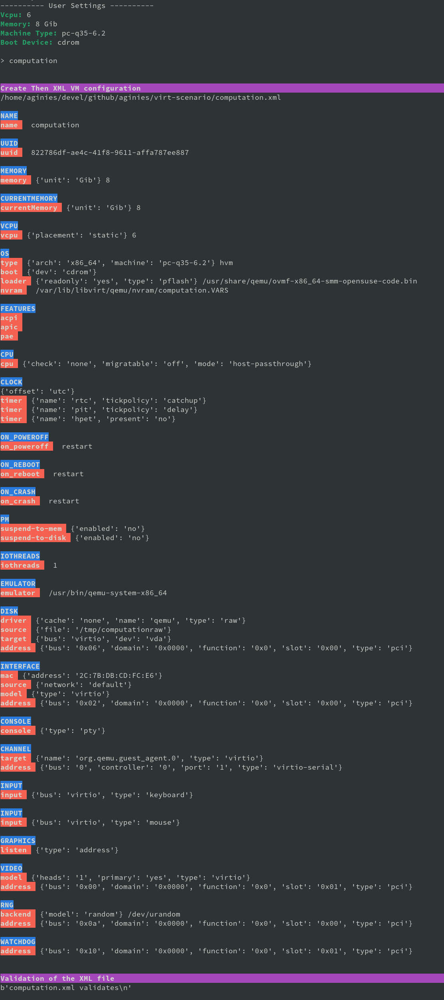

# GOALS

**EXPERIMENTATION** FOR [SUSE ALP OS](https://documentation.suse.com/alp/all/)

Prepare a libvirt XML guest configuration and the host to run a customized guest.
Idea is to use multiple **templates** and concatenate them to create the
expected Guest XML file.



# Devel Information

A lot of variable are currently set in the code and will be changeable in the futur
Still lot of work TODO...

# Devel planning / TODO

* ~~mechanism to create the Guest XML file from template~~
* ~~define all scenarios (list)~~
* ~~post customization of XML config~~
* ~~show host configuration~~
* ~~implement interactive shell~~
* define conflict/compatibility between scenarios
* create needed files on host (images, network definition, etc...)
* improve customization based on scenario

# User settings

User can set some parameters which will be used to create the XML file
* boot device
* memory
* vcpu
* machine type

# Possible Features

* CPU performance
* Video performance
* Network performance
* Storage performance
* Video performance
* Clock performance
* Using host hardware
* Access host OS filesystem

# Possible Scenarios

Draft available:
* Computation
* Desktop
* Secure VM

Not yet ready:
* Testing an OS
* Easy migration of VM
* Soft RT VM

# Stuff currently immutable

This is currently not changeable using the template, this needs to be
adjusted in the futur:
* console_data
* channel_data
* graphics_data
* video_data
* memballoon_data
* rng_data
* metadata_data

# Class / Functions

All scenarios are define in the **Scenarios** class. It can do direct
configuration calling **BasicConfiguration.XXX** or **ComplexConfiguration.XXX**,
or request a specific features calling **Features.XXX**

```
class Scenarios()
	-> BasicConfiguration.XXX
	-> ComplexConfiguration.XXX
	-> Features.XXX
```

```
class Features()
	-> XXX_perf() -> BasicConfiguration.XXX
		      -> ComplexConfiguration.XXX
```

```
class BasicConfiguration()
	name(self, name)
	vcpu(self, vcpu)
	cpumode(self, cpumode, migratable)
	power(self, suspend_to_mem, suspend_to_disk)
	audio(self, model)
	input(self, inputtype, bus)
	watchdog(self, model, action)
	emulator(self, emulator)
	memory(self, unit, max_memory, memory)
	osdef(self, arch, machine, boot_dev)
	ondef(self, on_poweroff, on_reboot, on_crash)
	features(self, features)
	clock(self, clock_offset, clock)
	iothreads(self, iothreads)
```

```
ComplexConfiguration()
	disk(self, disk, source_file)
	network(self, mac, network, intertype)
	access_host_fs(self)
	tpm(self, tpm_model, tpm_type, device_path)
```

# Files (WIP)

* **template.py**: libvirt XML template definition
* **scenario.py**: all the action to create the scenario are done there
* **proto_host.py**: create the net xml file and the storage
* **proto_guest.py**: create dict to file all the template
* **immutable.py**: Immutable data (to be removed when implementation will be done...)
* **qemulist.py**: provide list of available options in qemu
* **util.py**: needed functions
* **main.py**: launch the tool and create the final XML file

# Usage

**main.py** will create an **xml** based file on template and validate it.
Currently **desktop** and **computation** are available.

```
chmod 755 main.py
./main.py
```
